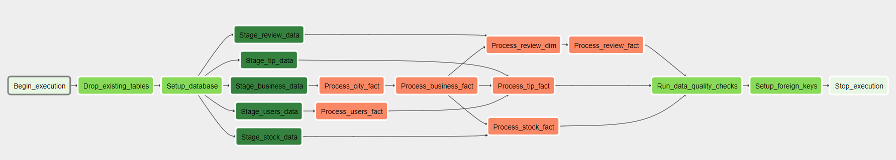

# Yelpify
The goal of this project is to create a data pipeline for Yelp business review data and stock market values. Potentially, once the data is in its final format, it can be used to derive relationships between how much people use they app, their sentiment on reviews and the stock price of yelp and others businesses that yelp users review ( Chipotle, McDonalds, ShakeShack, etc..)

We can help business owners checking how well their business listed on yelp are doing in the eyes of the public, by bringing this data to the surface and build busines specific dashboards.

The following techologies shall be used for this pipeline:

- **Storage:** AWS S3 for file object storage due to his high availbility, simple access, low cost for massive amounts of that and almost infinite scalability in terms of storage space. Storing 1gb or 10tb of data only increases the cost of application but not the performance of the underlying system. This is a perfect solution for ever increasing datasets with frequent access of from/to data pipelines
- **Orchestration:** Airflow will be used to orchestrate data pipelines runs. Thus pipeline can be run on a schedule, 1x a day, 1x a week, 1x month, etc. The user will have the possibility to choose the schedule to run and its frequency, without any overhead conflict.
- **Data Warehouse:** AWS Redshift serves as a perfect solution for this, since it is designed for massive amounts of data processing and transformation. Normal SQL will be used to apply transformation to the raw data and store it in a Redshift Cluster. This cluster can scaled accordingly to the need of the users. CPUs, memory and storage space can be added accordingly to the demand of the end users. The cluster can be scaled up in terms of resources to accomodate more users of the app, to alows for a continous and smooth experience, where queries run at a good speed. The final snowflake data schema can be used in any report/visualization or to feed Machine Learning models. This schema is easily digestable and its connection are easily understandable.
- **Data Processing:** PySpark will be used for some of the initial data processing. Since the data arrives from difference sources and in massive datasets, it will be useful for the initial ingestion and data partitioning to be performed used Spark technologies. This can be done in a EMR cluster, which can easily be scaled up/down according to the needs (dataset size and how fast the pipeline should run)

Let's address the following 3 future *what if* scenarios:
* **The data was increased by 100x**
    * This will not pose any problem, since S3 scalability is tremendous. Due to its object store capabilities, storing 1gb or 100gb of data will incur in the same access speed and performance. Will only increase its costs. Likewise, the data backing up the *Redshift* cluster will also not suffer with its increase, since more storage space can be added to the cluster on demand and as needed. The only factor to consider is cost of such operations
* **The pipelines would be run on a daily basis by 7 am every day**
    * This is as easy as it gets by setting the frequency of *Airflow* to run daily. Furthermore, they way the pipeline is set-up, it will only be run on the daily subset of the data, which is extremely reduced. That will allow for a very performant pipeline run.
* **The database needed to be accessed by 100| people**
    * Also not a problem for our *Redshift* Cluster, since its hardware can be changed on demand by adding more nodes to it in response to the demand of our downstream users.


# Datasets
## Yelp Customer Data
These datasets can be found in [Kaggle](https://www.kaggle.com/yelp-dataset/yelp-dataset). It comes in `JSON` format and the following files can be found:
- `yelp_academic_dataset_checkin`
- `yelp_academic_dataset_user`
- `yelp_academic_dataset_business`
- `yelp_academic_dataset_tip`
- `yelp_academic_dataset_review`

In totality, these datasets occupy roughly 7gb of storage space. There are millions of rows on most of these datasets.


### Checkin
* business_id: string (nullable = true)
* date: string (nullable = true)

### User
*  average_stars: double (nullable = true)
*  compliment_cool: long (nullable = true)
*  compliment_cute: long (nullable = true)
*  compliment_funny: long (nullable = true)
*  compliment_hot: long (nullable = true)
*  compliment_list: long (nullable = true)
*  compliment_more: long (nullable = true)
*  compliment_note: long (nullable = true)
*  compliment_photos: long (nullable = true)
*  compliment_plain: long (nullable = true)
*  compliment_profile: long (nullable = true)
*  compliment_writer: long (nullable = true)
*  cool: long (nullable = true)
*  elite: string (nullable = true)
*  fans: long (nullable = true)
*  friends: string (nullable = true)
*  funny: long (nullable = true)
*  name: string (nullable = true)
*  review_count: long (nullable = true)
*  useful: long (nullable = true)
*  user_id: string (nullable = true)
*  yelping_since: string (nullable = true)

### Business
* address: string (nullable = true)
 * attributes: struct (nullable = true)
   * AcceptsInsurance: string (nullable = true)
   * AgesAllowed: string (nullable = true)
   * Alcohol: string (nullable = true)
   * Ambience: string (nullable = true)
   * BYOB: string (nullable = true)
   * BYOBCorkage: string (nullable = true)
   * BestNights: string (nullable = true)
   * BikeParking: string (nullable = true)
   * BusinessAcceptsBitcoin: string (nullable = true)
   * BusinessAcceptsCreditCards: string (nullable = true)
   * BusinessParking: string (nullable = true)
   * ByAppointmentOnly: string (nullable = true)
   * Caters: string (nullable = true)
   * CoatCheck: string (nullable = true)
   * Corkage: string (nullable = true)
   * DietaryRestrictions: string (nullable = true)
   * DogsAllowed: string (nullable = true)
   * DriveThru: string (nullable = true)
   * GoodForDancing: string (nullable = true)
   * GoodForKids: string (nullable = true)
   * GoodForMeal: string (nullable = true)
   * HairSpecializesIn: string (nullable = true)
   * HappyHour: string (nullable = true)
   * HasTV: string (nullable = true)
   * Music: string (nullable = true)
   * NoiseLevel: string (nullable = true)
   * Open24Hours: string (nullable = true)
   * OutdoorSeating: string (nullable = true)
   * RestaurantsAttire: string (nullable = true)
   * RestaurantsCounterService: string (nullable = true)
   * RestaurantsDelivery: string (nullable = true)
   * RestaurantsGoodForGroups: string (nullable = true)
   * RestaurantsPriceRange2: string (nullable = true)
   * RestaurantsReservations: string (nullable = true)
   * RestaurantsTableService: string (nullable = true)
   * RestaurantsTakeOut: string (nullable = true)
   * Smoking: string (nullable = true)
   * WheelchairAccessible: string (nullable = true)
   * WiFi: string (nullable = true)git remote add origin
 * business_id: string (nullable = true)
 * categories: string (nullable = true)
 * city: string (nullable = true)
 * hours: struct (nullable = true)
   * Friday: string (nullable = true)
   * Monday: string (nullable = true)
   * Saturday: string (nullable = true)
   * Sunday: string (nullable = true)
   * Thursday: string (nullable = true)
   * Tuesday: string (nullable = true)
   * Wednesday: string (nullable = true)
 * is_open: long (nullable = true)
 * latitude: double (nullable = true)
 * longitude: double (nullable = true)
 * name: string (nullable = true)
 * postal_code: string (nullable = true)
 * review_count: long (nullable = true)
 * stars: double (nullable = true)
 * state: string (nullable = true)

**Note:** The business data set contains nested JSON. This is not a problem for PySpark, nor for Redshift, since JSON paths cam be use to flatten the data. But in our case, we will not be using those nested fields, since there is no use for them in our analysis.


### Tip
*  business_id: string (nullable = true)
*  compliment_count: long (nullable = true)
*  date: string (nullable = true)
*  text: string (nullable = true)
*  user_id: string (nullable = true)


### Review
*  business_id: string (nullable = true)
*  cool: long (nullable = true)
*  date: string (nullable = true)
*  funny: long (nullable = true)
*  review_id: string (nullable = true)
*  stars: double (nullable = true)
*  text: string (nullable = true)
*  useful: long (nullable = true)
*  user_id: string (nullable = true)

# Data Pre-Processing

In order to get these giants datasets a little bit more digestible for Redshift, we will proceed with some cleansing of the data in S3. This will involve dropping all not useful columns for our purpose. We will be using PySpark on a EMR cluster to achieve our goal. In the process, we will be outputting the files in Parquet format (Snappy compression). Redshift [can copy](https://aws.amazon.com/about-aws/whats-new/2018/06/amazon-redshift-can-now-copy-from-parquet-and-orc-file-formats/#:~:text=Amazon%20Redshift%20Can%20Now%20COPY%20from%20Parquet%20and%20ORC%20File%20Formats,-Posted%20On%3A%20Jun&text=You%20can%20now%20COPY%20Apache,more%20efficiently%20and%20cost%2Deffectively.) data in these formats straight from S3. This will be useful since compressed data takes way less storage space and parqut columnar format is extremely efficient in data retrieval.
On top of this, we will also output data to a data-lake, where each dataset will be stored in S3, efficiently partioned. This data lake can be used by all sorts of purposes in the future.

Running the pre-processing is a one-time-deal, since these datasets are static in nature. Although, its easy to setup a trigger on AWS if new files are dropped to a S3 bucket staging area, which then starts and EMR machine and runs this Spark Job. This [link](https://medium.com/@tamizhgeek/remote-spark-submit-toyarn-running-on-emr-9804b89d82d2) provides clear instructions on how to submit such job. [Here](https://airflow.readthedocs.io/en/latest/howto/operator/apache/spark.html#sparksubmitoperator) is how to use a Airflow Operator to run such submit job. Simply running `etl.py` will do the trick. Setting up such mechanisms is outside of the scope of this project.

### Checkin
This dataset will be ignored all together since it does not offer any value for our analysis goal

### User
All the fields will be kept in the `user` dataset. These are all useful. In S3 the data-lake this dataset will be partitioned by:
- yelping_since  (`year, month, day`)

This partitioning style will be extremely useful. This is our second largest dataset, and being able to run a subset of the data through the pipeline is of major importance. Having a proper way of segment the data, such as by date, makes it extremely useful and coupled with *Airflow* backfill capabilities will make our pipeline run smoothly.


|    name|average_stars|      yelping_since|pyear|pmonth|pday|
|--------|-------------|-------------------|-----|------|----|
|  Rafael|         3.57|2007-07-06 03:27:11| 2007|     7|   6|
|Michelle|         3.84|2008-04-28 01:29:25| 2008|     4|  28|
|  Martin|         3.44|2008-08-28 23:40:05| 2008|     8|  28|
|    John|         3.08|2008-09-20 00:08:14| 2008|     9|  20|
|    Anne|         4.37|2008-08-09 00:30:27| 2008|     8|   9|


### Business
This dataset will be highly reduced in the number of columns. Since most columns are unnecessary for our goal, only the following will be kept:
- business_id
- name,
- categories,
- state,
- city,
- address,
- postal_code, 
- review_count,
- stars

Additionally, the data lake will have the following partitions:
- state
- city

|                name|stars|pstate|          pcity|
|--------------------|-----|------|---------------|
|The Range At Lake...|  3.5|    NC|      Cornelius|
|   Carlos Santo, NMD|  5.0|    AZ|     Scottsdale|
|             Felinus|  5.0|    QC|       Montreal|
|Nevada House of Hose|  2.5|    NV|North Las Vegas|
|USE MY GUY SERVIC...|  4.5|    AZ|           Mesa|


### Review
This is ultimately the most important dataset. It sores all the review made by clients on the respective establishments. 
It will link to the business and user table via their foreign keys `business_id` and `user_id`. 
Correctly setting up this data in S3 is crucial. This is the largest dataset and the one that is going to get sequentially incremented as users use the app. For the correct performance of our app, ingesting the full dataset into *Redshift* every time is non-sensical due to its shear size. 
This is where *Airflow* shines with its concept of backfill, which will be furhet explained in the following sections. For now, this dataset will be processed. All its columns will be kept and the data will be written to S3 partitioned by the `year, month, day` of the review. 

Partitions:
- pyear
- pmonth
- pday


|stars|                text|pyear|pmonth|pday|
|-----|--------------------|-----|------|----|
|  2.0|As someone who ha...| 2015|     4|   4|
|  1.0|I am actually hor...| 2013|    12|   7|
|  5.0|I love Deagan's. ...| 2015|    12|   7|
|  1.0|Dismal, lukewarm,...| 2011|     5|   6|
|  4.0|Oh happy day, fin...| 2017|     1|   7|


The following is a partition example for this data `review/pyear=2018/pmonth=5/pday=4`. Which makes its super easy to retrieve the file corresponding to a certain date and upload it to the *Redshift* cluster

### Tip

This dataset will have similar pre-processing as other ones, with partitions being done by `year, month, day` of tip/comment. 
Example of the data:

|         business_id|compliment_count|                text|             user_id|                 dt|pmonth|pyear|pday|
|--------------------|----------------|--------------------|--------------------|-------------------|------|-----|----|
|UYX5zL_Xj9WEc_Wp-...|               0|Here for a quick mtg|hf27xTME3EiCp6NL6...|2013-11-26 18:20:08|    11| 2013|  26|
|Ch3HkwQYv1YKw_FO0...|               0|Cucumber strawber...|uEvusDwoSymbJJ0au...|2014-06-15 22:26:45|     6| 2014|  15|
|rDoT-MgxGRiYqCmi0...|               0|Very nice good se...|AY-laIws3S7YXNl_f...|2016-07-18 22:03:42|     7| 2016|  18|
|OHXnDV01gLokiX1EL...|               0|It's a small plac...|Ue_7yUlkEbX4AhnYd...|2014-06-06 01:10:34|     6| 2014|   6|
|GMrwDXRlAZU2zj5nH...|               0|8 sandwiches, $24...|LltbT_fUMqZ-ZJP-v...|2011-04-08 18:12:01|     4| 2011|   8|


## Stock Market - Dataset
This is a simple dataset that can be obtained from an [API](https://medium.com/@andy.m9627/the-ultimate-guide-to-stock-market-apis-for-2020-1de6f55adbb) and its simply stored in S3  as a comma separated value format. These datasets, one per company to be analyzed, tend to be quite small. Use it as a broadcast table is quite easy.

For this specific dataset the data was found [here](https://www.kaggle.com/borismarjanovic/price-volume-data-for-all-us-stocks-etfs). This huge dataset is limited on the timeframe, but has more than 7000 companies registered in the NY exchange.

There is no need for pre-processing of this data. Upon loading it to *Redshift* the company name can be added as a column such that it can be joined in the *Yelp* dataset on the `business_name`


|Date      |Open |High |Low  |Close|Volume  |OpenInt|
|----------|-----|-----|-----|-----|--------|-------|
|2012-03-02|22.05|26   |22   |24.58|17504991|0      |
|2012-03-05|24.86|24.86|20.9 |20.99|2991210 |0      |
|2012-03-06|19.83|20.5 |19.36|20.5 |1154290 |0      |
|2012-03-07|20.49|20.63|19.95|20.25|387956  |0      |
|2012-03-08|20.3 |20.39|19.96|20   |436871  |0      |


**Note:** Business name must be added to the table when loaded to Redshift

## Airflow - Orchestrator
Airflow will be used to orchestrate this data pipeline. This is an excellent tool for this sort of jobs, which involve multiple moving parts, with many componenents coming from different places. Airflow has the concept of the DAG, which is a sequential and independent succession of steps. Each task in this DAG will apply some sort of business logic on the data pipeline. 

### Dag Definition
Below is shown the overall orchestration of ETL. Please, notice how elaborate are the relationships between the multiple tasks. This is due to the necessary order the operations need to occur at, due to the `Foreign Key` & `Primary Key` constraint relationship between the tables. 



The very final Task is to perform some very basic data quality checks. Here we kept it simple since our only mission was to move the data from S3 to a data warehouse format, so we only count the number of records inserted into the table and make sure the are `>0`. In the furture, as downstream users utilize this data warehouse more elaborate checks can be put in place to respond to their needs.

Quality checks are run for the following list of tables `['business_fact', 'city_fact', 'review_fact', 'tip_fact', 'users_fact', 'stock_fact', 'review_dim']`.

A single message is outputted to the logs, `INFO - business_fact has passed data quality check with 1002 records`. This message can be broadcasted elsewhere downstream for better communication. Using the [Slack Airflow](https://airflow.apache.org/docs/stable/_modules/airflow/operators/slack_operator.html) operator is a great way of giving real time feedback to end users of data freshness, availibility or alert the data engineer for any pipeline errors. Such can easily be implemented in this pipeline for a feature enhancement.


### Backfill
One of the most acclaimed concepts of *Airflow* is the backfill. This allows for a pipeline that was engineered today, run on data that was generated in the past. Let's imagine that our app generates a certain amount of data everyday, which needs to be processed and put in our *Redshift* cluster. The pipeline should not run on the full dataset everytime it runs, for performance reasons and also redundancy. If all these datasets, which can be split by day, have the same format, our pipeline can run on them on day-per-day basis. This allows for short runs our data pipeline is manageable and digestible pieces of the data. In turn, we can run a pipeline created today and add in the start date parameter to be sometime in the past ( e.g. 3 years ago) alongside the frequency our pipeline should be run(e.g. daily). Airflow will than create runs for all the dates from the start data until today. Within the DAG itself the code will have access to the timestamp parameter and can then use it to select the correct dataset from S3

## Redshift
A Cluster will be spun-up with the following characteristics:
- DWH_CLUSTER_TYPE=multi-node
- DWH_NUM_NODES=4
- DWH_NODE_TYPE=dc2.large

### Data Model
A snowflake model will be used. This makes it very easy to access data for any sort of downstream user, such as a Analyst, ML engineer, business reviewer, etc. Luckily, the dataset we got is already quite there when it comes to snowflake model, we just need to make small adjustements. 

We are going to use the review as our dimension table with 6 supporting fact tables. Additionally, we are going to split the data that comes from the review original dataset into facts and dimensions. 


**Observation:** Be aware that the column order matters. Whichever order one has on the parquet or csv files needs to be maintained when copied into Redshift using the `COPY` command. Same applies for the `INSERT INTO SELECT` statements, the order of the source must match the order in the target. 

#### Data Dictionary

``` JS
Table business_fact as B {
  business_id varchar [pk]
  name varchar
  categories varchar
  review_count bigint
  stars count
  city_id varchar
  address varchar
  postal_code varchar
}
```
``` JS
Table city_fact as C {
  city_id varchar [pk] 
  state varchar
  city varchar
}
```
``` JS
Table users_fact as U {
  user_id varchar [pk]
  yelping_since timestamp
  name varchar
  average_stars int
  review_count bigint
}
```
``` JS
Table review_dim as R {
  review_id varchar [pk]
  review_date timestamp
  business_id varchar
  user_id varchar
}
```
``` JS
Table review_fact as RF {
  review_id varchar [pk]
  stars int
  text varchar 
}
```
``` JS
Table stock_fact as S{
  stock_id varchar [pk]
  business_name varchar
  date timestamp
  close_value float
}
```
``` JS
Table tip_fact as T {
  tip_id varchar [pk]
  business_id varchar
  user_id varchar
  text varchar
  tip_date timestamp
  compliment_count bigint
}
```
``` JS
Ref: T.business_id > B.business_id
Ref: U.user_id < T.user_id
Ref: B.city_id > C.city_id
Ref: B.business_id < R.business_id
Ref: U.user_id < R.user_id
Ref: RF.review_id > R.review_id
Ref: B.name < S.business_name

```

#### Database Diagram


